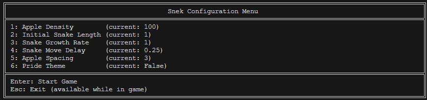
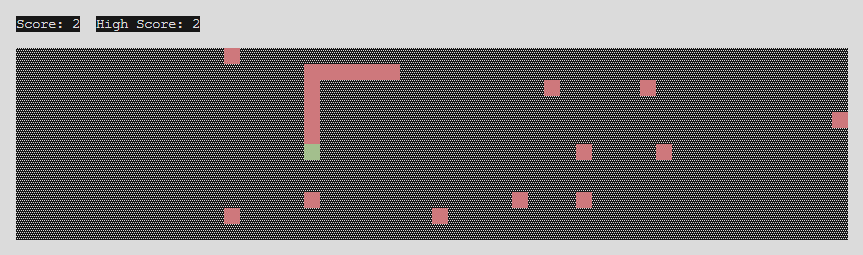
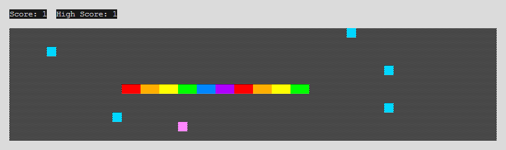

# snek

- [snek](#snek)
  - [Installation](#installation)
    - [Running from source](#running-from-source)
  - [Usage](#usage)
  - [Known Bugs](#known-bugs)

It's snake. But *snek*. In **Python**. It supports all OSes that Python can run on, and was designed to look like a retro game from the early 80s. It runs entirely in your terminal, no GUI libraries required, and uses minimal external dependencies (just `colorama`).

The world width and height is automatically set to the maximum it can be for the size of terminal it is running in, and supports recalibrating when the terminal is resized. Currently the only ways to die are by hitting the world borders, or hitting the snake's body, in which case the score (but not high score), will reset.

## Installation

> [!NOTE]\
> Please make sure you have support for Unicode fonts enabled in your system's settings. If you don't, the game will not look as it should.

### Running from source

* Make sure you have [Python](https://python.org) installed and is in your system environment variables as **`python`**. If you do not have Python installed, you can install it from [here](https://python.org/download/).
* Download and extract the repository from [here](https://github.com/skifli/snek/archive/refs/heads/master.zip). Alternatively, you can clone the repository with [Git](https://git-scm.com/) by running `git clone https://github.com/skifli/snek` in a terminal.
* Navigate into the root directory of your clone of this repository.
* Run the command `python -m pip install -r requirements.txt`.

## Usage

* Run the command `python snek.py` in the root of your clone of this repository.

## Known Bugs

Please see [**`bugs.md`**](bugs.md).
