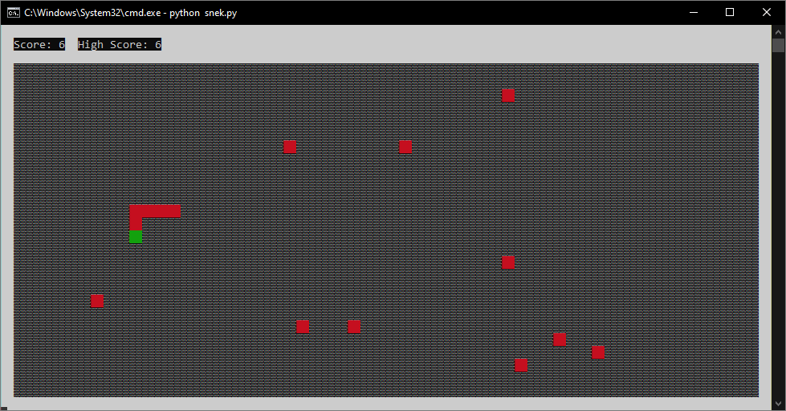

# snek

- [snek](#snek)
  - [Installation](#installation)
    - [Running from source](#running-from-source)
  - [Usage](#usage)
  - [Known Bugs](#known-bugs)
  - [Star History](#star-history)

It's snake. But *snek*. In **Python**. It supports all OSes that Python can run on, and was designed to look like a retro game from the early 80s. It runs entirely in your terminal, no GUI libraries required. It is written in just over 200 lines of code, and if you remove the fancy formatting while maintaining readability it would be around 150 lines of code.

The world width and height is automatically set to the maximum it can be for the size of terminal it is running in, so please don't make the terminal size smaller while playing. Currently the only way to die is by hitting the world borders, in which case the score (but not high score), will reset.

## Installation

> **Note** Please make sure you have support for Unicode fonts enabled in your system's settings. If you don't, the game will not look as it should.

### Running from source

* Make sure you have [Python](https://python.org) installed and is in your system environment variables as **`python`**. If you do not have go installed, you can install it from [here](https://python.org/download/).
* Download and extract the repository from [here](https://github.com/skifli/snek/archive/refs/heads/master.zip). Alternatively, you can clone the repository with [Git](https://git-scm.com/) by running `git clone https://github.com/skifli/snek` in a terminal.
* Navigate into the root directory of your clone of this repository.
* Run the command `python -m pip install -r requirements.txt`.

## Usage

* Run the command `python snek.py` in the root of your clone of this repository.

## Known Bugs

Please see [**`bugs.md`**](bugs.md).

## Star History

<a href="https://star-history.com/#skifli/snek&Date">
  <picture>
    <source media="(prefers-color-scheme: dark)" srcset="https://api.star-history.com/svg?repos=skifli/snek&type=Date&theme=dark" />
    <source media="(prefers-color-scheme: light)" srcset="https://api.star-history.com/svg?repos=skifli/snek&type=Date" />
    
  </picture>
</a>
